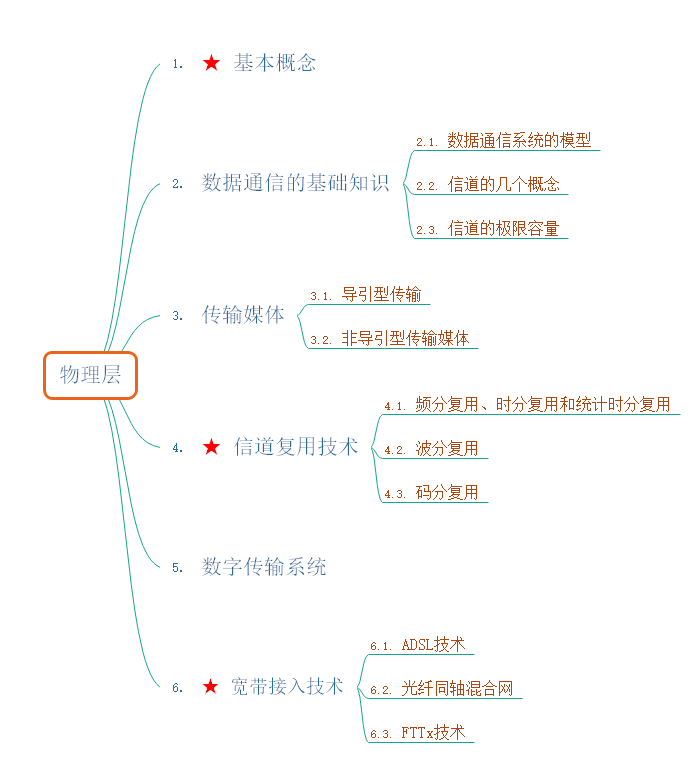

大纲

# 物理层的基本概念

物理层考虑的是怎样才能在连接各种计算机的传输媒体上`传输数据比特流`，而不是指具体的传输媒体。  

物理层的作用就是尽可能的屏蔽掉不用传输媒体和通信手段的差异。  

用于物理层的协议也常称为规程（procedure）  

## 物理层的主要任务

确定与传输媒体接口的一些特性。  

- 机械特性：指明接口所用接线器的形状和尺寸、引脚数目和排列、固定和锁定装置等。  
- 电气特性：指明在接口电缆的各条线上出现的电压范围。  
- 功能特性：指明某条线上出现的某一电平的电压的意义。  
- 过程特性：指明对于不同功能的各种可能事件的出现顺序。  

 