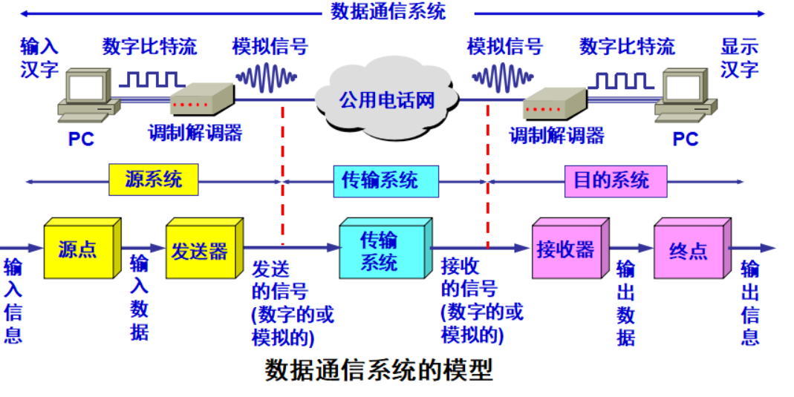

# 物理层的基本概念

物理层考虑的是怎样才能在连接各种计算机的传输媒体上`传输数据比特流`，而不是指具体的传输媒体。  

物理层的作用就是尽可能的屏蔽掉不同传输媒体和通信手段的差异。  

用于物理层的协议也常称为规程（procedure）  

## 物理层的主要任务

确定与传输媒体接口的一些特性。  

- 机械特性：指明接口所用接线器的形状和尺寸、引脚数目和排列、固定和锁定装置等。  
- 电气特性：指明在接口电缆的各条线上出现的电压范围。  
- 功能特性：指明某条线上出现的某一电平的电压的意义。  
- 过程特性：指明对于不同功能的各种可能事件的出现顺序。  

# 数据通信的基础知识
  
## 数据通信系统的模型

数据通信系统包括三大部分：源系统（或发送端、发送方）、传输系统（或传输网络）和目的系统（或接收端、接收方）。  

通过下面这张图我们可以清晰的看出通信的过程，这是非常重要的，在以后的知识点钟我们主要就是通过这张图展开来讲解的。  

  

在详细介绍三大系统中各个设备的功能时，我们先来了解一些常用术语。  

- 消息 （message）：如话音、文字、图像、视频等。  
- 数据（data）：运送消息的实体。是使用特定方式表示的信息，通常是有意义的符号序列。  
- 信号（signal）：数据的电气或电磁的表现。  
- 模拟信号（analogous signal）：代表消息的参数的取值是连续的。  
- 数字信号（digital signal）：代表消息的参数的取值是离散的。  
- 码元（code）：在使用时间域（或简称为时域）的波形表示数字信号时，代表不用离散数值的基本波形。  

源点通常是能产生数据比特流的设备（如：计算机），是将消息加工成数据的设备。  

由于源点产生的数据比特流（[基带信号](#1)）要经过[调制](#2)之后才能在传输系统上进行传输，所以我们需要发送器执行这个功能。而接收器的功能正好是相反的。  

## 与信道相关的几个基本概念

- 信道（channel）：一般用来表示向某一方向传送信息的媒体。所以一条通信线路一般包括一条发送信道和一条接收信道。  

- 单向通信（单工通信）：只能有一个方向的通信而没有反方向的交互。  

- 双向交替通信（半双工通信）：通信的双方都可以发送信息，但不能同时发送或同时接收。  

- 双向同时通信（全双工通信）：通信的双方可以同时发送和接收信息。  
  
- 基带信号（基本频带信号）：是一种来自信源的信号。如计算机输出的代表各种文字或图像文件的数据信号都是基本信号。  

- 调制：基带信号往往含有较多的低频成分，甚至还要直流成分，而许多信道并不能传输这种低频成分或直流成分。因此必须对基带信号进行调制。  
  
调制有两大类  

1. 基带调制（编码）：仅对基带信号的波形进行变换，使它能够与信道特性相适应。**变换后的信号仍然是基带信号**。  

2. 带通调制：利用**载波**（就将货车一样，是一种运输波）进行调制，把基带信号的频率范围搬移动较高的频段，并**转换成模拟信号**，在模拟信道中传输。经过载波调制后的信号就是**带通信号**。  

### 常用的编码方式

- 不归零制：正电平代表1，负电平代表0。  
- 归零制：正脉冲代表1，负脉冲代表0。  
- 曼彻斯特编码：位于周期中心的向上跳变代表0，位于周期中心的向下跳变代表1。也可以反过来。  
- 差分曼彻斯特编码：在每一位的中心处始终都有跳变。位开始边界有跳变代表 0，而位开始边界没有跳变代表 1。  

  
### 带通调制的方法

