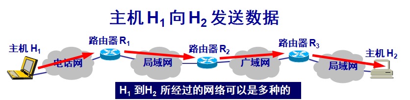
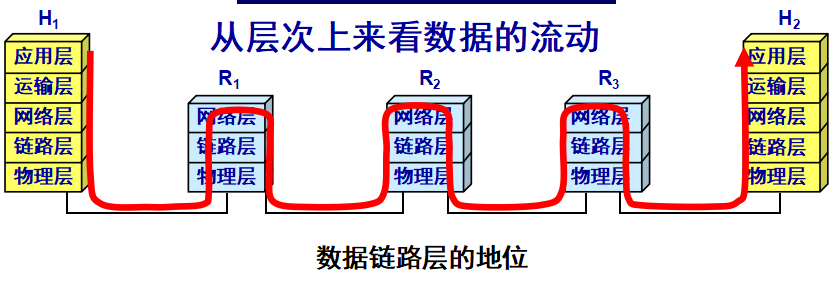
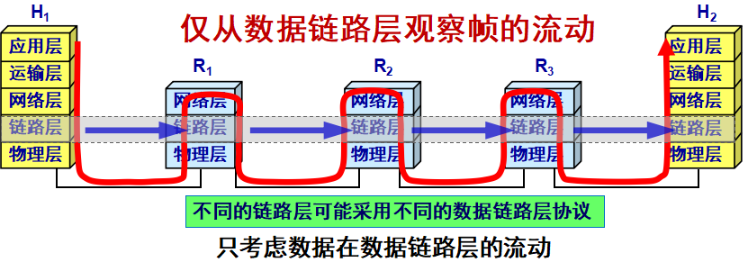
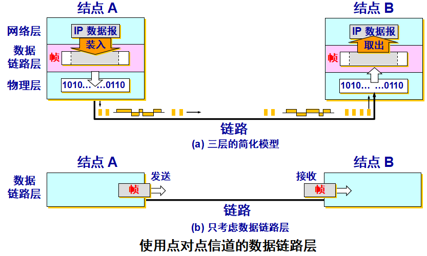
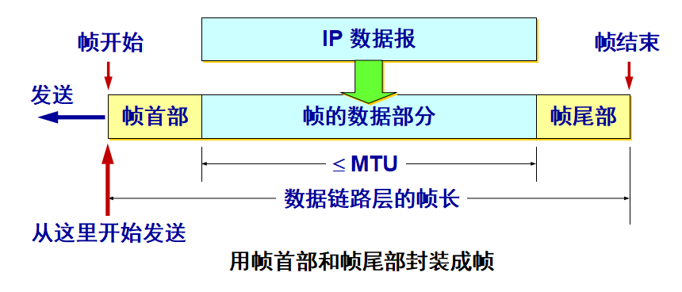
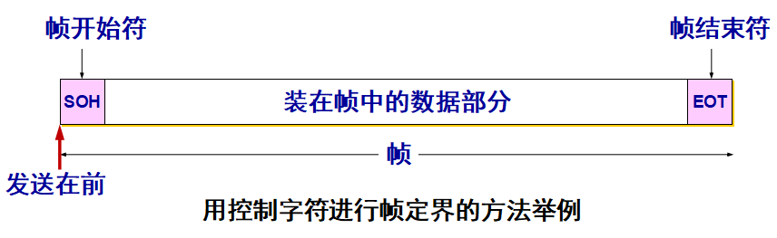
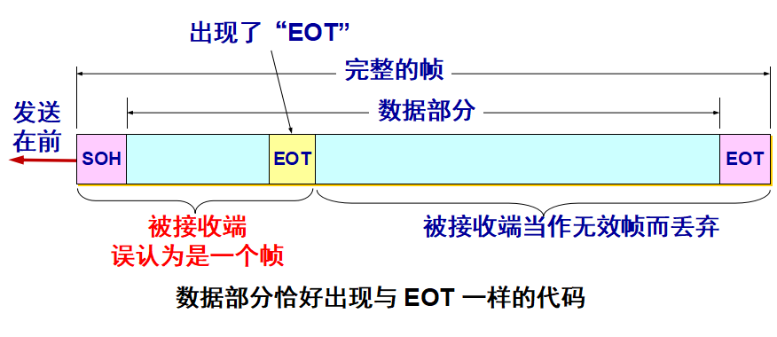
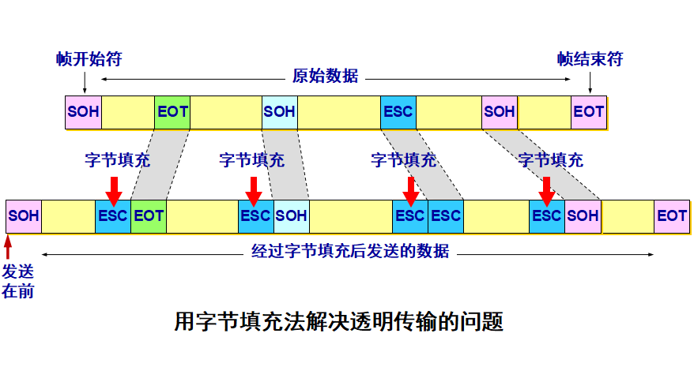

# 目录

- [使用点对点信道的数据链路层](#3.1)  
    - [数据链路和帧](#3.1.1)
    - [三个基本问题](#3.1.2)
- [点对点协议 PPP](#3.2)
    - [PPP 协议的特点](#3.2.1)
    - [PPP 协议的帧格式](#3.2.2)
    - [PPP 协议的工作状态](#3.2.3)
- [使用广播信道的数据链路层](#3.3)
    - [局域网的数据链路层](#3.3.1)
    - [CSMA/CD 协议](#3.3.2)
    - [使用集线器的星形拓扑](#3.3.3)
    - [以太网的信道利用率](#3.3.4)
    - [以太网的 MAC 层](#3.3.5)
- [扩展的以太网](#3.4)
    - [在物理层扩展以太网](#3.4.1)
    - [在数据链路层拓展以太网](#3.4.2)
    - [虚拟局域网](#3.4.3)
- [高速以太网](#3.5)
    - [100BASE-T 以太网](#3.5.1)
    - [吉比特以太网](#3.5.2)
    - [10 吉比特以太网（10GE）和更快的以太网](#3.5.3)
  
---  

# 数据链路层

数据链路层使用的信道主要有以下两种类型  

- 点对点信道
    这种信道使用一对一的点对点通信方式。  
- 广播信道
    这种信道使用一对多的广播通信方式，因此过程比较复杂。广播信道上连接的主机很多，因此必须使用专用的共享信道协议来协调这些主机的数据发送。

在网络层我们讨论的是怎么样将分组从一个网络通过路由器，转发到另一个网络中。而在数据链路层中我们讨论的是怎么样将一个分组从一台主机传送到另一台主机。  

具体过程如下：  

  

  

  

---

# 使用点对点信道的数据链路层

##  数据链路和帧

**链路** (link) 是一条无源的点到点的物理线路段，中间没有任何其他的交换结点。一条链路只是一条通路的一个组成部分。  

**数据链路** (data link) 除了物理线路外，还必须有通信协议来控制这些数据的传输。若把实现这些协议的硬件和软件加到链路上，就构成了数据链路。  
现在最常用的方法是使用适配器（即网卡）来实现这些协议的硬件和软件。  
一般的适配器都包括了数据链路层和物理层这两层的功能。  

**在点对点信道的数据链路层的协议数据单元是帧。**    

总的来说就是将协议加在链路上，而在物理层当中传输的只是比特流，不用考虑协议的问题。  

  

由图可知点对点信道的数据链路层在通信时的主要步骤：  

1. 结点 A 的数据链路层把网络层交下来的 IP 数据报添加首部和尾部封装成帧。  
2. 结点 A 把封装好的帧发送给结点 B 的数据链路层。  
3. 若结点 B 的数据收到的帧无差错，则从收到的帧提取出 IP 数据报交给上面的网络层；否则丢弃这个帧。 

## 三个基本问题

在数据链路层中我们使用的协议有很多，但总的来说有三个基本问题是共同的。即：**封装成帧**、**透明传输**、**差错检测**。  

### 封装成帧

封装成帧 (framing) 就是在一段数据的前后分别添加首部和尾部，然后就构成了一个帧。确定帧的界限。  
首部和尾部的一个重要作用就是进行帧定界。  

当数据是由可打印的 ASCII 码组成的文本文件时，帧定界可以使用特殊的帧定界符。  
控制字符 SOH (Start Of Header) 放在一帧的最前面，表示帧的首部开始。另一个控制字符 EOT (End Of Transmission) 表示帧的结束。  

  

### 透明传输

如果数据中的某个字节的二进制代码恰好和 SOH 或 EOT 一样，数据链路层就会错误地“找到帧的边界”。  

  

解决方法：**字节填充** (byte stuffing) 或**字符填充** (character stuffing)。  
发送端的数据链路层在数据中出现控制字符“SOH”或“EOT”的前面插入一个转义字符“ESC” (其十六进制编码是 1B)。  
接收端的数据链路层在将数据送往网络层之前删除插入的转义字符。  
如果转义字符也出现在数据当中，那么应在转义字符前面插入一个转义字符 ESC。当接收端收到连续的两个转义字符时，就删除其中前面的一个。  

### 差错检测

在传输过程中可能会产生比特差错：1 可能会变成 0 而 0 也可能变成 1。  
在一段时间内，传输错误的比特占所传输比特总数的比率称为误码率 BER (Bit Error Rate)。  
误码率与信噪比有很大的关系。  
为了保证数据传输的可靠性，在计算机网络传输数据时，必须采用各种差错检测措施。  

在数据链路层广泛使用的是**循环冗余检验** CRC （Cyclic Redundancy Check）的检错技术。原理如下  

在发送端，先把数据划分为组。假定每组 k 个比特。  
假设待传送的一组数据 M = 101001（现在 k = 6）。我们在 M 的后面再添加供差错检测用的 n 位冗余码一起发送。  
**冗余码的计算：**用二进制的模 2 运算进行 2n 乘 M 的运算，这相当于在 M 后面添加 n 个 0。  
得到的 (k + n) 位的数除以事先选定好的长度为 (n + 1) 位的除数 P，得出商是 Q 而余数是 R，余数 R 比除数 P 少 1 位，即 R 是 n 位。  
将余数 R 作为冗余码拼接在数据 M 后面发送出去。  

eg:   
现在 k = 6, M = 101001。  
设 n = 3, 除数 P = 1101，  
被除数是 2nM = 101001000。   
模 2 运算的结果是：商 Q = 110101，  
           余数 R = 001。  
把余数 R 作为冗余码添加在数据 M 的后面发送出去。发送的数据是：2nM + R   
   即：101001001，共 (k + n) 位。 

